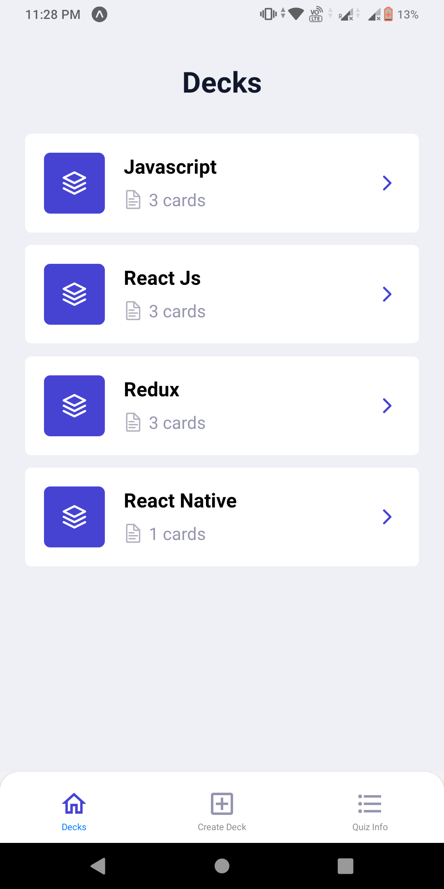
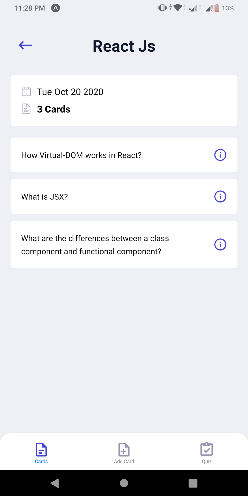
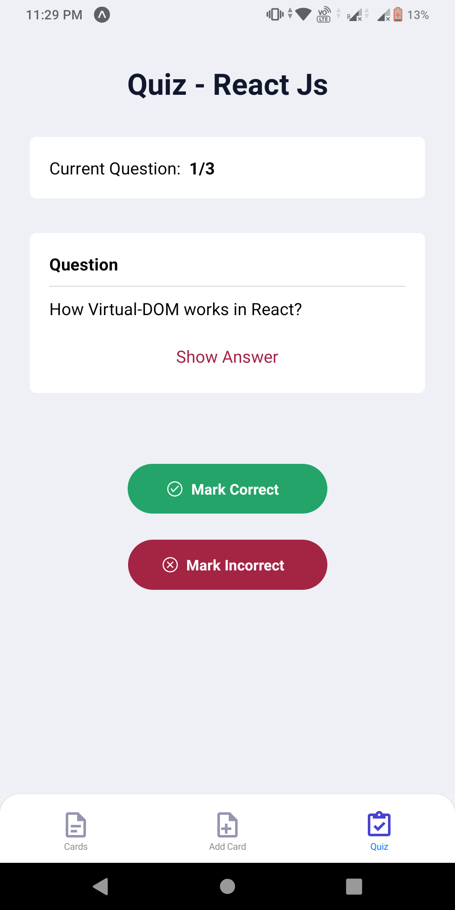
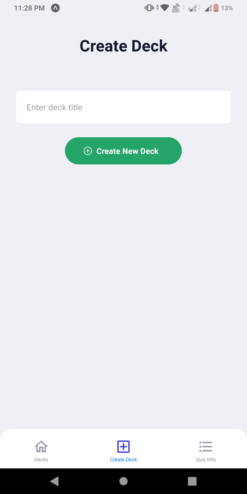
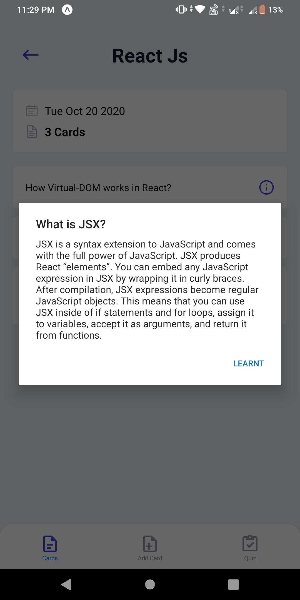
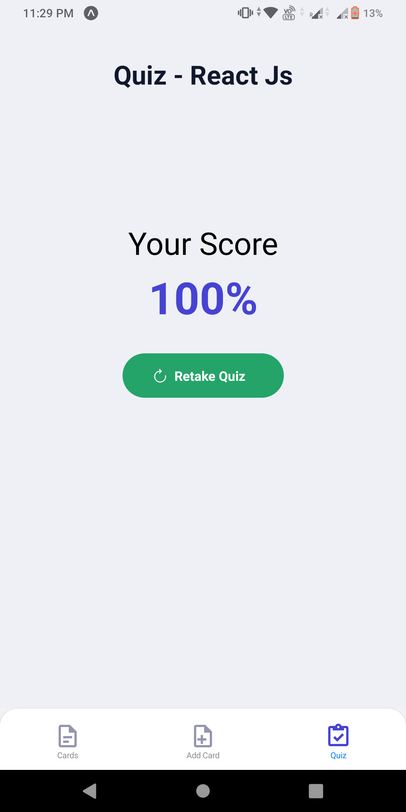
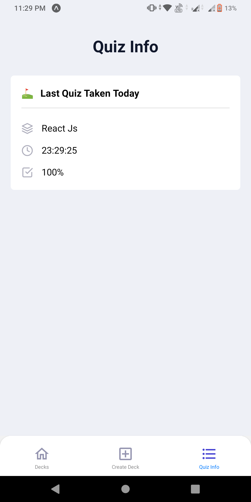

## FlashCards Project - Built with React Native
Udacity Become React Developer ND

### Project Problem Statement 📜
This App is based on the classic game of flash cards. Flash cards is used by people, generally students, to memorise things. In its physical form, people write question on one side of the card and answer on the other side of the card. Then they shuffle the cards and start the quiz. They read the question and try to answer it. After answering they turn the card to see whether the answer was correct or not and then mark the count of correct/incorrect in a sheet. Finally once all the cards are done, they see how many correct questions they answered.

### Project Features 🕹

1. View all decks
2. Add new deck
3. View last quiz taken info
4. View All flashcards of deck
5. Add new flashcards to deck
6. Take Quiz on flashcards
7. Get Local Notifications

### Routes Navigation ⛳️

| Stack Navigation       |
|------------------------|
| Home Tabs Navigation   |
| Deck Tabs Navigation   |

| Home Tabs Navigation       | Deck Tabs Navigation                   |
|----------------------------|----------------------------------------|
| `DeckList` View All Decks  | `DeckView/:deckId` Flashcards of Deck  |
| `NewDeck` Create New Deck  | `NewCard/:deckId` Add Flashcard to Deck|
| `QuizInfo` Last Quiz Info  | `QuizView/:deckId` Take Flashcards Quiz|

### Installation & Setup ⚙️

You should have `npm`, `node` & `expo-cli` installed in your machine, to confirm type `node --version` v14.12.0(or above) & `expo -V` v3.27.14(or above) in terminal. Below are steps to setup project in your system :

1. Clone the `master` branch of this repository
2. Open Terminal in project folder (containing `package.json` file)
3. Run `npm install` and wait for all dependencies to download + install
4. Finally run `expo start` this will automatically launch Expo DevTools is running at `http://localhost:19002`
5. Scan QR Code with Expo Android or iOS App & run application

### Project Screnshots 📱

	

		

	

	

		

		

